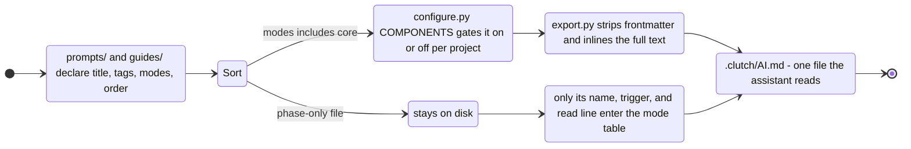
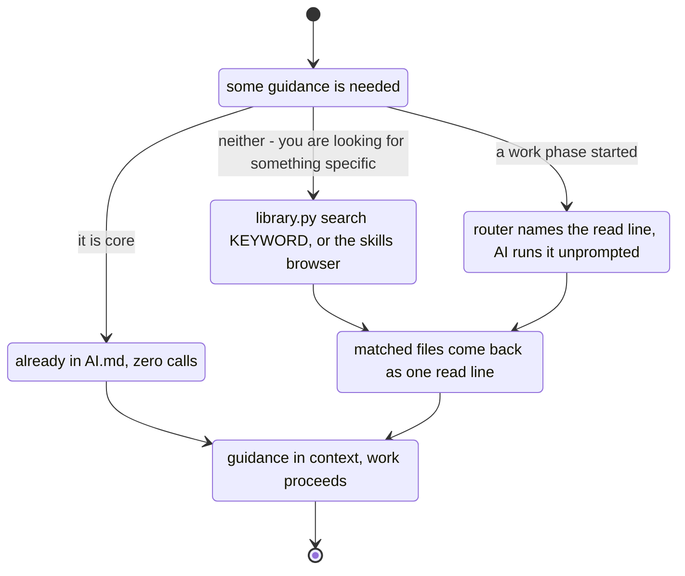
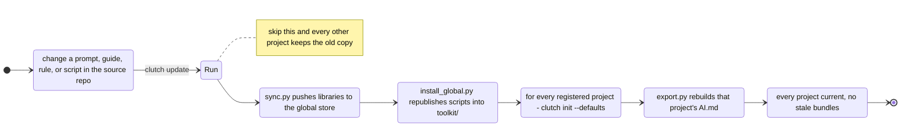

# How clutch works

Four views of the same system: what the AI does in a session, how a file decides
whether it ships in the bundle or waits on disk, the three ways a prompt gets
retrieved, and how a change reaches every project.

Diagrams are `stateDiagram-v2` per `prompts/flowcharts.md`. Render them with
`python scripts/mermaid_export.py ARCHITECTURE.md --scale 4`.

---

## 1. A session: load once, then switch phases

The core loads one time and stays resident. Everything after that is a phase
change, and each phase has an exit checklist that gates the next one.

```mermaid
stateDiagram-v2
    direction TB

    [*] --> Load
    Load : Read .clutch/AI.md once and cache it
    Load --> Core
    Core : Core resident - persona, pitfalls, memory API, comms, commit, propagation
    Core --> Route : request arrives

    state Route <<choice>>
    Route --> Plan : 3+ files or competing approaches
    Route --> Code : approach already settled
    Route --> Debug : broken, cause unknown
    Route --> Review : auditing a diff
    Route --> Wrap : done, or context about to reset

    Plan : plan mode - modes/plan.md plus a design playbook if a shape is at stake
    Code : code mode - modes/code.md
    Debug : debug mode - modes/debug.md, grep solutions before anything else
    Review : review mode - modes/review.md plus GRADING.md
    Wrap : wrap mode - modes/wrap.md

    Plan --> Code : checkpoint written, risky assumption verified
    Debug --> Code : root cause named as a mechanism
    Review --> Code : defects to fix
    Code --> Review : substantial change
    Code --> Wrap : verified, small change
    Review --> Wrap : report only
    Wrap --> [*] : memory persisted, propagation run
```

The AI picks the phase itself from the request. The user can override by naming one
("plan mode", "/debug"), and that always wins.

---

## 2. Where a file goes: inlined, or waiting on disk

Frontmatter is the switch. `modes: [core]` means the file is already in the window,
so a phase never re-reads it - a phase only ever names what is new.

The cost of `core` is permanent context; the cost of `deferred` is one extra read
when the phase starts. That is the whole trade-off.

---

## 3. Three ways a prompt gets found

Most loading is automatic. The manual paths exist for when you know what you want
and the router does not.

Keyword search matches `tags` first, then title, then path - so
`library.py search encoding` finds the file whose tags carry it, not just one whose
name happens to.

---

## 4. Propagation: nothing moves on its own

The standing rule from `guides/MAINTAINING.md`. A change that is not propagated is
not finished.

`library.py` is published with the rest of `scripts/`, so consumer projects resolve
mode files out of the global store without carrying the markdown themselves.
