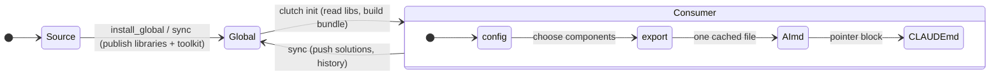

# clutch - info

<!-- Two tiers, kept current. Visuals over code. See prompts/human-output.md. -->

## Rundown

clutch is a per-project toolkit that improves AI-assisted development. It grades
commits, logs session history, collects reusable cross-project solutions, and packs
everything an assistant needs into one cached `AI.md` bundle so it reads a single file
instead of a dozen. Libraries (guides, prompts, code-rules) live once in a global store;
each project is a thin "consumer" that reads from it. Install a project with one command:
`clutch init`.

## How it fits together

There are two roles. The **source** repo (this one) owns the libraries and publishes them
to the global store at `%USERPROFILE%\.clutch`. Every other project is a **consumer**:
it carries only config plus scripts, reads the libraries from the global store, and bakes
the chosen parts into its own `AI.md`. `sync.py` moves shared content up and down;
`export.py` builds the bundle; `session_report.py` mines the real `.claude` transcript so
reports are extracted, not guessed. The one thing that matters: nothing library-shaped is
copied per project, so there is a single source of truth.

## Key pieces

| Piece | What it does | Notes |
|---|---|---|
| `export.py` | Dumps guides, prompts, stack rules, memory, recent history into one `AI.md` | Driven by the component registry in `configure.py` |
| `configure.py` + `tui.py` | Arrow-key menu to pick which components go into the bundle | Persists as `bundle_include` in config |
| `sync.py` | Two-way sync with the global store; consumers only sync solutions + history | Role-aware (source vs consumer) |
| `setup.py` / `install_project.py` | One-shot install: seed global, hook, scaffold info.md, build bundle | `clutch init` is a PATH command |
| `session_report.py` | Extracts what a session did from the `.claude` transcript | Requests, files, commits, chapters |
| `guides/` + `prompts/` + `rules/` | The libraries: how to work, how to write, what to avoid | Source-owned, global is canonical |
| memory: `checkpoint/` `history/` `solutions/` | Working, episodic, and long-term memory stores | See `guides/MEMORY.md` |

## Important bits / gotchas

- The **global store is canonical** for libraries. Editing a guide/prompt in the source,
  then `sync.py`, then re-running `export.py` in a project is how a change propagates.
- Each project keeps its **own copy of the scripts**. After changing a toolkit script,
  republish with `install_global.py`; consumers pick it up on the next `clutch init`.
- **Operating mode** ("clutch engaged") is a voice plus a reliability marker, gated by
  `operating_mode` in config. It is a costume, not a jailbreak: refusal and AI-awareness
  stay intact.
- **Human-output rules** apply to everything the assistant writes: no co-author trailers,
  standard-keyboard characters only, casual explanatory comments, creative calls left to
  the user, verify before asserting.
- Rendering diagrams needs Node plus a system Chrome/Edge (see the mermaid solution note).
