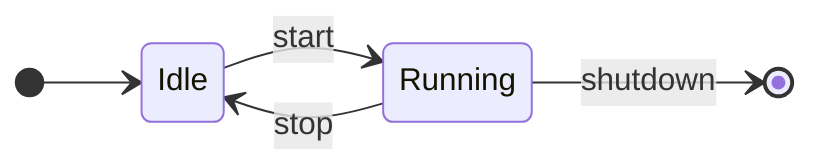

# Flowcharts - author them as Mermaid state diagrams

When a task calls for a flowchart, a process/workflow diagram, or any "boxes and
arrows showing how something moves between stages," author it as a **Mermaid state
diagram** (`stateDiagram-v2`), following
<https://mermaid.js.org/syntax/stateDiagram.html>. Prefer this over `graph`/`flowchart`
syntax for anything that is fundamentally states-and-transitions - it reads cleaner and
renders more consistently.

## Canonical syntax (v2)



- **Always `stateDiagram-v2`** (not the legacy `stateDiagram`).
- **`[*]`** is the start terminal (as a source) and the end terminal (as a target).
- **Transition with label:** `A --> B : event / guard`.
- **State with description:** `A : human-readable text`, or
  `state "long label" as A` when the id must stay short.
- **`direction LR`** for wide left-to-right flows, `TB` for top-to-bottom.

## The constructs to reach for

- **Choice / branch** (a decision node):
  ```mermaid
  state choose <<choice>>
  Validate --> choose
  choose --> Accepted : valid
  choose --> Rejected : invalid
  ```
- **Composite / nested state** (a stage that has sub-steps):
  ```mermaid
  state Deploy {
      [*] --> Build
      Build --> Test
      Test --> Release
  }
  ```
- **Parallel regions** (concurrent sub-states) - split a composite with `--`:
  ```mermaid
  state Active {
      direction LR
      [*] --> Listening
      --
      [*] --> Logging
  }
  ```
- **Fork / join** for splitting to and merging from concurrency:
  `state f <<fork>>` ... `state j <<join>>`.
- **Notes**, used sparingly for a constraint the diagram can't show:
  `note right of Running : retries capped at 3`.

## Rules

1. **One diagram, one concern.** If it needs more than ~15 states, split it or use a
   composite to hide detail - don't make an unreadable wall.
2. **Every non-terminal state is reachable and can exit.** No orphan states, no dead
   ends unless they legitimately go to `[*]`.
3. **Label the transitions, not just the states** - the event/condition that causes the
   move is usually the useful information.
4. **Ids are terse and stable** (`AwaitPayment`), descriptions carry the prose. Don't
   put spaces/punctuation in ids.
5. **Wrap in a ```mermaid fence** in markdown; save standalone diagrams as `.mmd`.
6. **Validate before claiming done** - render it with the export tool below; a diagram
   that doesn't parse is not finished.

## Exporting a high-res image

Use the toolkit's exporter (wraps `@mermaid-js/mermaid-cli`):

```bash
python .clutch/scripts/mermaid_export.py diagram.mmd --scale 4
```

It writes a vector `diagram.svg` (resolution-independent) and a high-res
`diagram.png`. It also accepts a markdown file and renders every ```mermaid block in
it. See `scripts/mermaid_export.py --help` for theme/background/size options.
