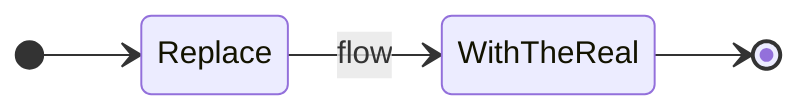

# {project} - info

<!-- Two tiers, kept current. Visuals over code. See prompts/human-output.md.
     Standard-keyboard characters only. -->

## Rundown

<One short paragraph: what this is, what it does, current status. A newcomer should get
the gist in 20 seconds.>

## How it fits together

<2-5 sentences on the shape of it: the main pieces, how work flows through, and the one
constraint or risk that matters most.>

## Key pieces

| Piece | What it does | Notes |
|---|---|---|
| ... | ... | ... |

## Important bits / gotchas

- <decisions taken and why, constraints, non-obvious things a new dev must know>

<!-- No code in here. Diagrams, tables, and bullets. The code and planning/ hold the
     detail; info.md is the map. -->
